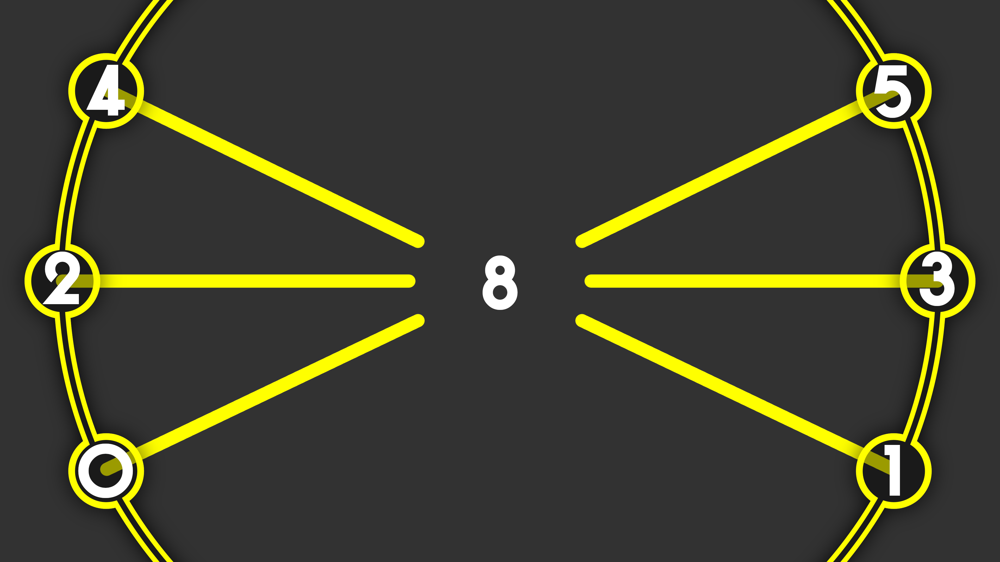

# Chart/Music Data
I have decided to use the actual game's chart/data format (.MNS files) instead of manually porting every chart to some new format. This file will serve as my knowlege base on the format. 

This information is from the [Amicitia Wiki](https://amicitia.miraheze.org/wiki/MNS) and [tge-was-taken's 010 Editor template](https://github.com/tge-was-taken/010-Editor-Templates/blob/master/templates/p4d_mns.bt) as well as my own findings.

At some point it would be very nice to get a graphical tool up and running to edit these files, but that is a long ways away.

MNS could stand for Music Note Storage, Music Note Sequence, Music Note Script, or Mapped Note Sequence. Something else? Who knows?

**Information in this could be completely wrong.**

# Header (36 bytes)
| Loc    | Type | Data            |
| ------ | ---- | --------------- |
| 0x000  | U32  | Magic (MNS_)    |
| 0x004  | U32  | Always 0        |
| 0x008  | U32  | Always 1        |
| 0x00C  | U32  | MusicId         |
| 0x010  | F32  | Song BPM        |
| 0x014  | U16  | MusicIdMajor    |
| 0x016  | U16  | Song difficulty |
| 0x018  | U32  | Unused?         |
| 0x01C  | U32  | Number of notes |
| 0x020  | U32  | Always 0        |

# Note (8 bytes per note)
Any data after the header is always a note.

| Offset | Type | Data            |
| ------ | ---- | --------------- |
| 0x00   | U8   | 1/4 of measure  |
| 0x01   | U8   | 1/4 of beat     |
| 0x02   | U16  | Measure of note |
| 0x04   | U8   | Lane/Button     |
| 0x05   | U8   | Hold duration   |
| 0x06   | U8   | Note metadata   |
| 0x07   | U8   | Always 0        |

## Note notes
- A note exists on a 4 beat measure, but can also be in one of 4 locations in between
    - It doesn't matter the song's time signature; notes are always aligned to a 4/4 time signature
    - This means that a note can exist in 16 locations on a measure
- Hold notes are created by specifying the length of the hold
    - I believe that this length is in measure subdivisions, that is 1/16 of a measure
- Notes have additional metadata at the end
    - 00 for normal notes and scratches
    - 01 fever scratches
    - 02 for P3D and P5D double notes
- Notes have 7 possible lanes they can be on
    - If a note exists in lane 8, then it becomes a scratch
    - Lanes 6 and 7 are unused
- Note lanes are defined as follows:
    - 0 - Lower left (Down)
    - 1 - Lower right (Cross)
    - 2 - Middle left (Left)
    - 3 - Middle right (Circle)
    - 4 - Upper left (Up)
    - 5 - Upper right (Triangle)
    - 8 - Scratch

