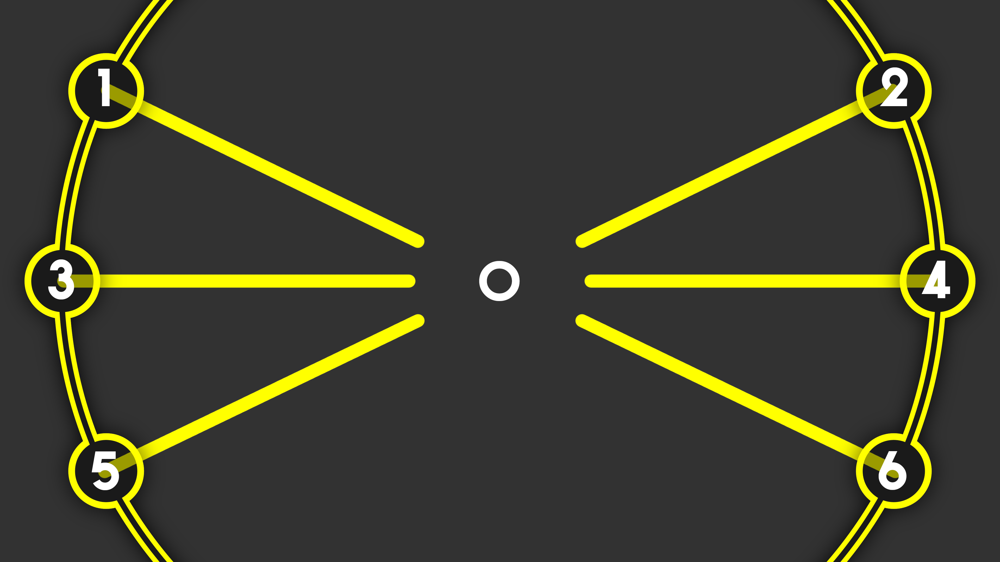

# THIS METHOD IS NO LONGER USED

# Chart Format
The scheme I've devised to store the chart information is basically just using the .lrc file format.

# Terminology
- A **note** refers to a type of note with they type being one of the following (the number is the note id)
    - 1 - Normal
    - 2 - Double
    - 3 - Hold Start
    - 4 - Hold End
    - 5 - Scratch
    - 6 - Fever Scratch
- A **unison note** is when two normal notes arrive at their destinations at the same time and are on opposite sides of each other (one is on the left side and one is on the right side) 
- A **position** refers to the position the note is traveling to (refer to the below image to see the note positions)
    - 0 - Scratch lane
    - 1 - Upper-left corner
    - 2 - Upper-right corner
    - 3 - Middle left side
    - 4 - Middle right side
    - 5 - Lower-left corner
    - 6 - Lower-right corner
- A **tag** refers to a note with a position

# Structure
- Charts start at the [0:00.000] tag to include metadata. This metadata is mandatory and must be on the first line. These are just strings, but they are contained in curly brackets and there are no spaces seperating them.
    - Title
    - Artist / Arranger
    - Duration
    - BPM
    - Styling (possible choices below)
        - p4d
        - p3d
        - p5d
    - Fever timestamps, seperated by commas
- Everything after the first line will be tag data.
    - A tag has a note id followed by a comma and then a position
    - `[0:05.000]1,1;1,4;`
      - This example has two tags, both being normal notes that will become a unison note spanning positions 1 and 4
- There can be multiple tags per line, and all tags end with a semicolon.

# Proper Porting of Charts
This is still up in the air, but the method I use involves getting a recording of the chart playing in the desired difficulty in the "View Perfect Play" mode. 60FPS PS4/PS5 capture from an external recording device is prefered, but I used a 30FPS capture from a PS Vita for the chart I made. The audio for the track is extracted and converted straight from the game's files. I then align the audio and the video in a video editor and analyze frame-by-frame to see the exact timestamp that the notes are hit.
As for trying to read the original chart format from the game to convert it, good luck.

# Other Notes
- Some LRC editors like to combine like lines together, but the game is not programmed to handle this. I am not sure what will happen if it tries to parse a line like this and I don't particularly care to find out.
- The LRC editor I use is [https://seinopsys.dev/lrc](https://seinopsys.dev/lrc)
    - This LRC editor has the line combination option enabled by default, so make sure to turn it off when you export your file
    - Also make sure that you export without metadata
- Do not include any LRC metadata with the chart